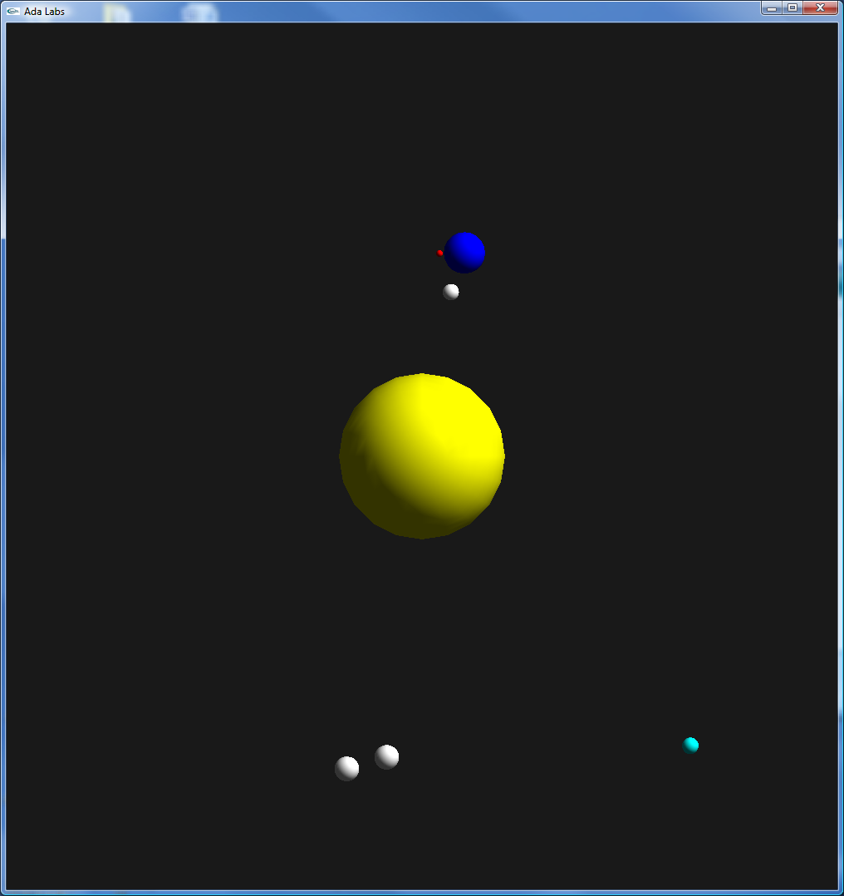

.. role:: ada(code)
    :language: ada

========
Packages
========

*The Solar_System API*

The purpose of this exercise is to factor out the code for stars into a package.

    Expected result

----------
Question 1
----------

From the exercise *Subprograms*, the structures and subprograms are now declared
in an external package, called :code:`Solar_System`.

Use the :code:`Solar_System` package to obtain a behavior similar to
the exercise *subprograms*.

----------
Question 2
----------

Create a child package :code:`Graphics` of :code:`Solar_System` to handle graphical
functionalities like :code:`Draw_Body` procedure.

-----------
Question 3
----------

Create a child package :code:`Data` of :code:`Solar_System` to initialize the solar
system object.

----------
Question 4
----------

Create a black hole (not visible) rotating around the sun, and create two objects
moving around that invisible point.
