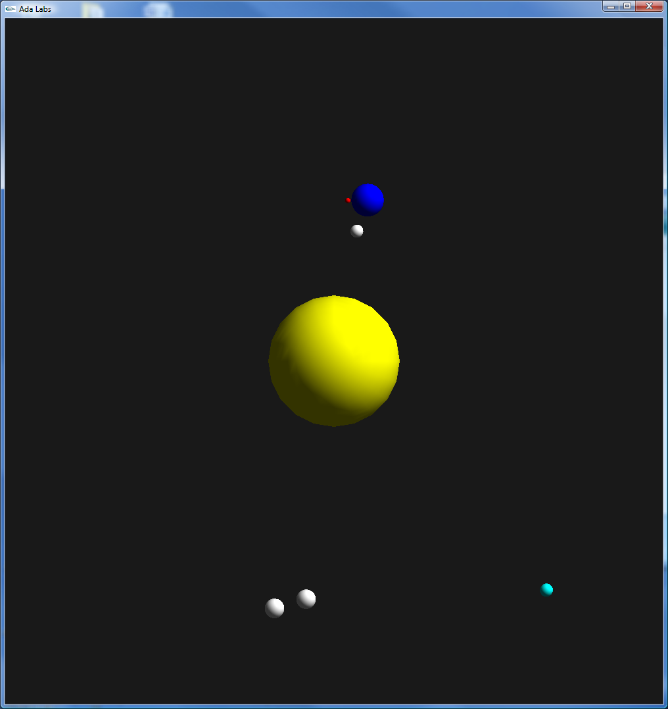

.. role:: ada(code)
    :language: ada

.. role:: C(code)
    :language: C

==================
Interfacing With C
==================

The purpose of this exercise is to write a minimalistic interface
to C code.

    Expected result

----------
Question 1
----------

Modify the functions in :file:`ada_float_maths.ads` so that they
are exported to C as :C:`float ada_cos(float)` and :C:`float ada_sin(float)`.

----------
Question 2
----------

Modify the functions in :file:`compute_c/compute.c` so that they call the
:C:`ada_cin` and :C:`ada_cos` functions.

NB: If you're not comfortable using C you can skip this question by copying
the answer source from the solution directly.

----------
Question 3
----------

In :file:`solar_system.adb`, import :ada:`Compute_X` and :ada:`Compute_Y` from
the C symbols :C:`compute_x` and :C:`compute_y`; and use them to update the position
of the bodies.

-----------
Question 4
-----------

Make it compile and run, there is a last element of surprise.

If you are stuck you can use the following tips, piecewise.

Tip: Multi-language projects are harder to build, namely the dependency tree is
not automatically solved unlike Ada.

Tip 2: You are building a piece of Ada calling C calling Ada, and the compiler
is lazy: it will only compile what is ``with``

Tip 3: Since C has implicit dependencies, it never ``with`` any package. And especially
the ``Ada_Float_Math`` package.
