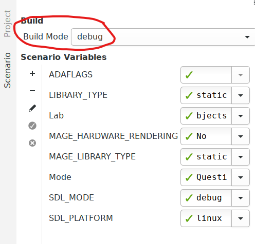
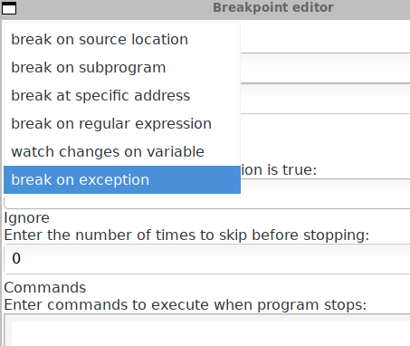

.. role:: ada(code)
    :language: ada

===================================
Advanced Debugging with GNAT Studio
===================================

The purpose of this exercise is to use GNAT Studio's integrated debugger.

This lab uses Tasking_Protected_Objects in **Answer** mode.

----------
Question 1
----------

In the code for :ada:`Move`, change the following lines

:ada:`Body_To_Move.Angle := Body_To_Move.Angle + Body_To_Move.Speed;`

to

:ada:`Body_To_Move.Angle := Body_To_Move.Angle + Body_To_Move.Speed / Body_To_Move.X;`

Try compiling and running, and see that a ``CONSTRAINT_ERROR`` is raised on this line.

----------
Question 2
----------

In the Scenario tab, select "debug" as the "Build mode" (topmost)

Start the debugger by clicking "Build and Debug". GNAT Studio will automatically enter the debug perspective.

Click on the "+" in the breakpoints view.

From the top-down-list on top, select "Break on exception"

Run the program through the debugger, and once the program stops on the faulty line, analyze
the value of all the parts of the expression, right clicking on the variables, and selecting
"Debug > Watch" to find the cause of the error.

Fix the error in the source by adding a :ada:`if`, then restart the program.

----------
Question 3
----------

We want to track all updates to the :ada:`Now` variable.
Restart the program in debug mode, while selecting "Stop at beginning of main
subprogram".
Once the debugger stops, right-click the :ada:`Now` variable, and select "Debug > Set
Watchpoint"
on :ada:'Now'.
Continue running the program.

Notice that :ada:'Now' is being updated on two different lines during the life of the application.

Stop the debugging session.

----------
Question 4
----------

Add a breakpoint to the :ada:`Move` procedure, then start a new debugging session.

Once the breakpoint is reached, move through the stack by using the "Call Stack" view.

Type ``info tasks`` in the debugger console; this will list all the active tasks.

Switch to the main task by typing the ``task 1`` command.

Return to the previous task.

Print :ada:'Body_To_Move' by typing ``print body_to_move`` in the "Debugger Console". Then *watch* the :ada:'Body_To_Move' variable.

On the "Variables" view, display all the content of this variable, and right click on the value
of its radius, then set it to 100.0.

Disable the breakpoint on :ada:`Move`, then resume execution.
Notice that the program resumes, with the body you modified being very large.
